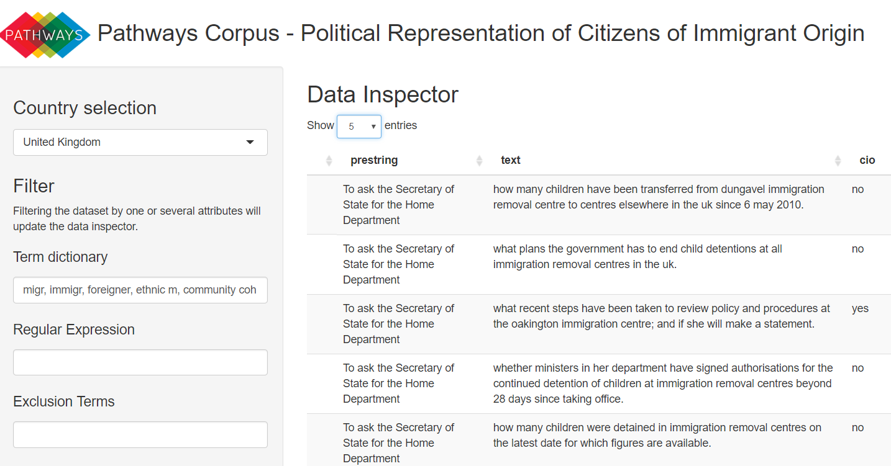

<!-- README.md is generated from README.Rmd. Please edit that file -->
Pathways Corpus
===============


This app enables interactive exploration of the Pathways Corpus for studying the political representation of Citizens of Immigrant Origin. It includes parliamentary written questions from democracies of eight European countries: Belgium, France, Germany, Greece, Italy, Netherlands, Spain, and the United Kingdom.

How to Install
--------------

You can download and install the latest development version of the app by running `devtools::install_github('methodds/pathways')`.

For Windows users installing from github requires proper setup of [Rtools](https://cran.r-project.org/bin/windows/Rtools/), for which a tutorial is available [here](https://github.com/stan-dev/rstan/wiki/Install-Rtools-for-Windows).

At the moment, pathways is not yet available on CRAN, but a submission is being prepared.

How to Use
----------

This package includes all datasets of the Pathways Corpus:

| name | country        | term      |
|:-----|:---------------|:----------|
| be   | Belgium        | 2010-2014 |
| de   | Germany        | 2009-2013 |
| el   | Greece         | 2015      |
| es   | Spain          | 2011-2015 |
| fr   | France         | 2007-2012 |
| it   | Italy          | 2008-2013 |
| nl   | Netherlands    | 2010-2012 |
| uk   | United Kingdom | 2010-2015 |

After loading pathways you can launch the shiny app in your browser to explore the corpus:

``` r
library(pathways)
explore_corpus()
```



The app can be used to filter corpora by several attributes and for visualizing high frequency / high keyness terms:


Citation
--------

A reference for the Pathways Corpus is currently in preparation. For now, please cite the following reference if you use this package for your publications:

      Carsten Schwemmer (2018). pathways: A 'Shiny' Application for Exploring the Pathways Corpus. R package version 1.0.0.
      https://github.com/methodds/pathways
